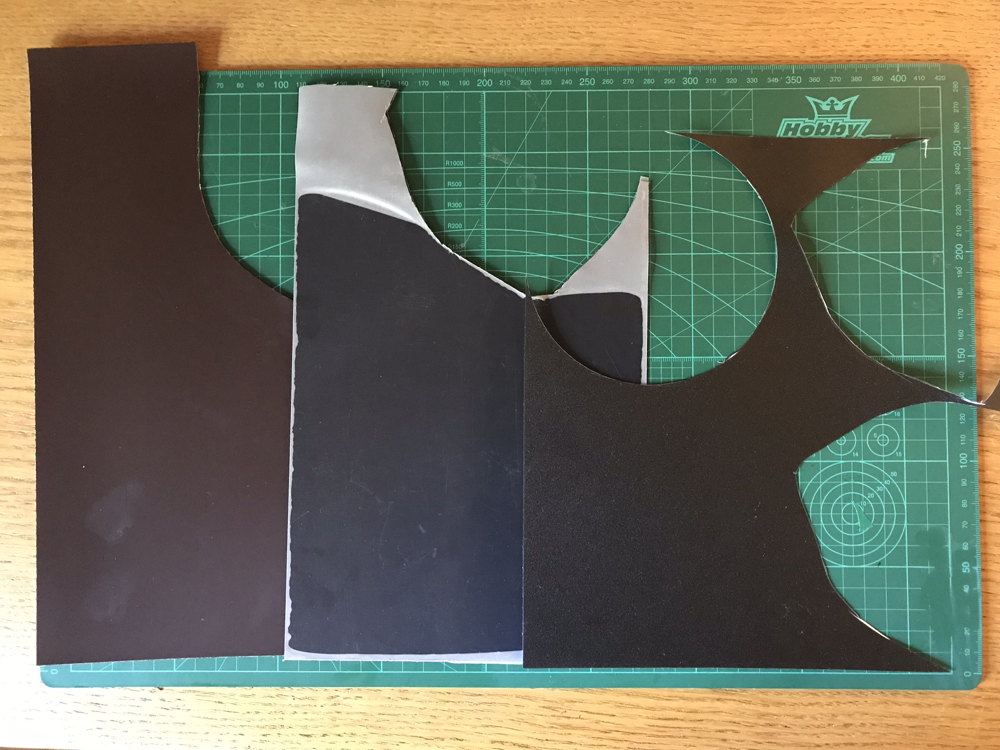

# Magnetic flexible build surface

_Print, take out, flex to remove print, print again._

## Materials
- **[PEI](https://www.banggood.com/1501500_3mm-Polyetherimide-PEI-Sheet-With-3M-Glue-For-3D-Printer-p-1341928.html) or [BuildTak](https://www.buildtak.com/product/buildtak-3d-printing-surface/)**, 0.3mm
- **[Carbon fiber plate](https://www.banggood.com/3K-2003000_5mm-Plain-Weave-Carbon-Fiber-Plate-Panel-Sheet-p-1097507.html)**, 0.5mm
  - thicker is harder to flex
  - slimmer may not be strong enough to flex back and be straight
- **[Self-adhesive strong magnetic sheet](https://www.amazon.de/gp/product/B07BHV16MH/)**, 1mm - 1.5mm [[1]](https://www.ebay.com/itm/Self-Adhesive-Magnetic-Sheet-Approx-A4-1-5mm-Thickness-by-The-Magnet-Shop/332715589652?hash=item4d77650014:g:s5IAAOSw9CVbRgJ2) [[2]](https://www.ebay.com/itm/Adhesive-Backed-A4-Magnetic-Sheet-1-5mm-Strong-Magnet-Craft-Die-Storage-Car-sign/192449807625?epid=27014569286&hash=item2ccee70509:g:IYAAAOSwtKVaex0p)
  - on aluminum heated bed
  - on carbon sheet

## Prepare

Clean aluminium heated bed, peel stock adhesive surface and clean it throughly.
Make sure the bed is secured with clips or screwed down, magnets are going to pull it up on flex surface removal.

Cut a piece of cardboard in shape of the aluminum bed, leaving cut outs for bed clips if you use them. The helper cardboard piece must be just right, following the shape of the bed and not covering the clips.

## Magnetic sheet

_Magnets hold our flex bed in place_

Cut two pieces of 1-1.5mm magnetic sheet roughly, they shall be big enough so shape helper can be placed in any way inside them.  
**DO NOT** cut them exactly for the shape of the aluminum bed yet!

Place two magnetic pieces together (glue sides outwards!) and rotate them against each other until they lock firmly, you shall feel it. There are two positions they lock firmly, choose one. It shall be almost impossible to move (not rotate!) them in one direction, while slightly easier in another. This is due to magnet strips placements in the sheet. This step is very important, please ensure the pieces do have strong attraction in this specific position.

With magnetic pieces secured firmly against each other, cut them with help of the cardboard helper shape.

## Carbon fiber sheet

_Carbon fiber sheet makes our bed flex_

Cut a piece of carbon fiber with regular scissors, use cardboard shape for guide. Do not remove dust shields (semi-transparent film) from the sheet just yet.

## Build surface

_This shall hold our prints securely in place_

Cut a piece of PEI or BuildTak with help of cardboard shape. Do not glue it to carbon fiber sheet just yet.

## Assembly

Remove adhesive protection film from one of magnetic pieces and place it on the aluminum bed carefully, aligning with the bed.

Cut out magnetic piece a bit more at the protruding corners, exposing bolt heads that tend to be not exactly level with the rest of the bed.

Place another magnetic piece on top of the first one, adhesive side up, align them and verify they are tightly locked.

Remove protective film from both upper magnetic piece and the carbon piece (one side only!) and glue them together, simply placing carbon piece on top of the magnetic piece.

_On this picture carbon piece was glued to the upper magnetic piece that was not cut yet, sorry._

Heat up the bed to 60-80C. (I'm not sure this step is necessary, just being on the safe side of the thermal expansion of the materials.)

Remove protective film from both carbon piece and build surface (PEI/BuildTak) and glue them together by carefully placing build surface on carbon piece, ensuring there are no air pockets, etc.

Adjust the printer end stops (flex bed adds ~2mm) and print something, remove the flex bed, flex it in different directions and your print shall just pop up from the surface.

Done! Removing prints was never so easy on MPMD!

## Optional

You may want to cut your carbon piece differently, for example leave a protruding lip for easier removal.

## Q&A

- **Magnets will not hold the carbon sheet at high temps**  
  Magnets are strong and seem to be not affected by the high temperatures, they keep the build surface in place even at 80C with no obvious weakening. Just please align them properly;
- **Magnets are thick, this shall make heat bed inefficient**  
  Not really, I do not observe any drop in het bed performance;
- **Is the shape important, can it be round?**  
  Guess so, it's just easy and convenient to remove grabing by that protruding edges near towers;
